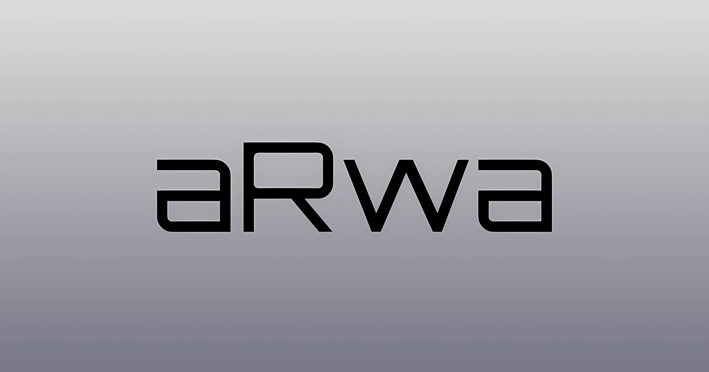

Hi! We would like to tell you about our project for the [ETHOnline2023 hackathon](https://ethglobal.com/events/ethonline2023). Our project is an oracle for real-world assets. We have developed an application using Next.js, wagmi, and rainbowkit, Solidity, viem. It is important to note that we do not use a traditional backend - instead, we rely on smart contracts.

Users can create requests to create a collection of their real-world assets. These requests then enter a pending status. Verifiers can view these requests in their admin panel, where they can review the request, attached documents, and set a price for the asset. They can create a collection using smart contracts and assign the person who made the request as the owner of the collection.

Afterwards, the user can specify the total number of tokens they want in their collection and mint the collection tokens. These tokens can be traded, listed on a marketplace, gifted to anyone, and used to create a DAO around the asset.

In summary, our project for the hackathon focuses on being an oracle for real-world assets. We leverage smart contracts to create collections of assets and enable token trading based on these assets. We aim to create a decentralized marketplace for exchange, gifting, and DAO creation around these assets.

Here is a link to our application that may help you better understand: https://app.arwa.space/

Privat key for admin - 0x207ccca3eca6568801fd173afcdbe2374a94b37ba7f2bc95257f6a2ea892d79b

[Created With LiteFront](https://github.com/uxname/litefront)

# Get started
- `npm install`
-  `cp .env_example .env`
- Edit `.env`
- `npm run dev`

**Production build:**
- `npm run build`
- `npm start`

# Contracts

**Goerli**

| Name | Address |
| -------- | ------- |
| Arwa Kyc Store | [0x3da1841dd7876f338dd8ef0fe75d9cc6fcc951cb](https://goerli.etherscan.io/address/0x3da1841dd7876f338dd8ef0fe75d9cc6fcc951cb) |
| Arwa Property Example | [0xca92bd8bb6798fbcbb385c124eebb0a5405498d2](https://goerli.etherscan.io/address/0xca92bd8bb6798fbcbb385c124eebb0a5405498d2) |
| Arwa Manager | [0x9e9c2aC8Abcd77aFB89299a69f4e6aFF9F851296](https://goerli.etherscan.io/address/0x7370d4e1E6d92E317D8fAacE71D1d2474f44E879) |

**Mantle Testnet**

| Name | Address |
| -------- | ------- |
| Arwa Kyc Store | [0x3dA1841DD7876f338dD8Ef0FE75D9CC6fcC951cb](https://explorer.testnet.mantle.xyz/address/0x3dA1841DD7876f338dD8Ef0FE75D9CC6fcC951cb) |
| Arwa Property Example | [0x32260793429f68a0B0921EDe8D57d0efA3b6b2E4](https://explorer.testnet.mantle.xyz/address/0x32260793429f68a0B0921EDe8D57d0efA3b6b2E4) |
| Arwa Manager | [0x4D25183bf40038c4125187B78410921568d7F807](https://explorer.testnet.mantle.xyz/address/0x4D25183bf40038c4125187B78410921568d7F807) |

**Scroll Sepolia**

| Name | Address |
| -------- | ------- |
| Arwa Kyc Store | [0x3dA1841DD7876f338dD8Ef0FE75D9CC6fcC951cb](https://sepolia.scrollscan.dev/address/0x3dA1841DD7876f338dD8Ef0FE75D9CC6fcC951cb) |
| Arwa Property Example | [0x32260793429f68a0B0921EDe8D57d0efA3b6b2E4](https://sepolia.scrollscan.dev/address/0x32260793429f68a0B0921EDe8D57d0efA3b6b2E4) |
| Arwa Manager | [0x638d49e65F7238c38181aE0C7f1df23c38Abf574](https://sepolia.scrollscan.dev/address/0x638d49e65F7238c38181aE0C7f1df23c38Abf574) |

**Polygon zkEvm Testnet**

| Name | Address |
| -------- | ------- |
| Arwa Kyc Store | [0x3dA1841DD7876f338dD8Ef0FE75D9CC6fcC951cb](https://testnet-zkevm.polygonscan.com/address/0x3dA1841DD7876f338dD8Ef0FE75D9CC6fcC951cb) |
| Arwa Property Example | [0x32260793429f68a0B0921EDe8D57d0efA3b6b2E4](https://testnet-zkevm.polygonscan.com/address/0x32260793429f68a0B0921EDe8D57d0efA3b6b2E4) |
| Arwa Manager | [0x638d49e65F7238c38181aE0C7f1df23c38Abf574](https://testnet-zkevm.polygonscan.com/address/0x638d49e65F7238c38181aE0C7f1df23c38Abf574) |

